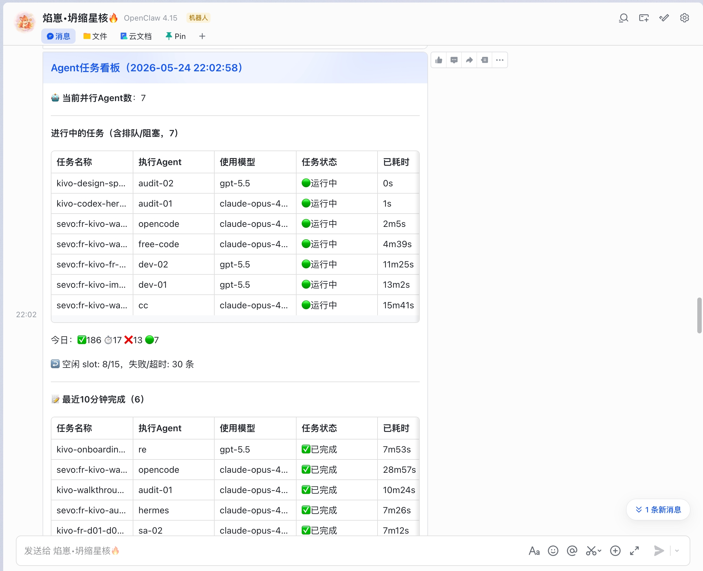

# ACO — 调度治理中心

> ACO is an AI agent operations orchestration framework that keeps dispatch, guardrails, task state, and recovery under deterministic control.

[](https://www.npmjs.com/package/@self-evolving-harness/aco)
[](./LICENSE)
[](./package.json)

ACO gives AI agent teams an operating layer, not just a prompt loop. It routes work to the right agent tier, enforces L2 plugin guards before bad runs start, keeps task state visible on a live board, and recovers from stalls, zombies, and hollow completions before they become expensive failures.

## Quick Start

### 1. Install

```bash
npm install -g @self-evolving-harness/aco
```

### 2. Initialize rules

```bash
aco init
```

This detects your OpenClaw environment and generates the initial ACO ruleset in `~/.openclaw/extensions/aco-rules/rules.json`.

### 3. Run the local walkthrough

```bash
aco demo
```

`aco demo` runs a zero-provider orchestration walkthrough and prints the full lifecycle: agent registration, task submission, rule interception, dispatch, retry, and completion summary.

## What ACO Controls

- Deterministic dispatch decisions before an agent starts work.
- Runtime guardrails that do not disappear inside long prompts.
- Visible task-state tracking for queued, running, failed, and completed work.
- Failure recovery paths for stale tasks, zombie sessions, and low-substance completions.

## Live Task Board in Your IM

The task board does not stay trapped behind a dashboard you have to remember to open. ACO's watchdog plugin pushes a live board card straight to your IM whenever task state changes, so the operational picture comes to you.



The card above shows real multi-agent work in motion: 7 agents running in parallel, 186 tasks completed, and the current running and recently finished tasks alongside the day's stats. Every state change reaches you in chat without polling, refreshing, or context switching.

This is zero configuration. The watchdog discovers your IM identity from runtime state, so there is no open_id to wire up, no webhook to register, and no extra setup step. Install ACO, run your agents, and the board starts pushing.

## Core Concepts

### Plugin system

ACO uses runtime plugins as L2 deterministic guards. Instead of trusting every agent to remember every rule, ACO intercepts execution at the control plane with plugins such as dispatch guard, objective-fact guard, output humanizer guard, notify guard, and doctor guard.

### Agent routing

ACO routes work by task type, role fit, tier, timeout discipline, and current capacity. The goal is simple: coding work goes to coding lanes, audits stay independent, and one busy agent does not quietly become a global bottleneck.

### Task board

ACO keeps task state in a board that powers visibility and recovery. The board is the operational source for queued, running, failed, cancelled, and succeeded work, and it backs commands such as `aco task` and `aco board`.

### Watchdog

ACO treats silent failure as a product bug. Its watchdog path detects stale runs, zombie sessions, timeout drift, and orphaned capacity so the system can surface the problem, clean state, and free the lane for the next task.

## Example

Start with the minimal plugin in `examples/hello-plugin/`.

It hooks the `before_prompt_build` event, loads as a real ACO plugin, and gives you a small end-to-end example to copy when building your own guards.

```bash
node -e "import('./examples/hello-plugin/index.js').then(m => console.log('OK:', m.default.id))"
```

Expected output:

```text
OK: aco-hello-plugin
```

For installation and wiring details, see `examples/hello-plugin/README.md`.

## When to Use ACO

| Use ACO when | ACO is not for |
| --- | --- |
| You need deterministic controls around multi-agent runtime behavior. | You only want a single prompt runner with no routing or recovery layer. |
| You want task state, retries, and watchdog behavior to stay visible. | You are looking for a hosted SaaS control plane out of the box. |
| You need plugin-level guardrails that survive long context windows. | You want agents to self-govern purely through prompt instructions. |
| You care about operational closure, not just generated text. | You do not need audits, task boards, or timeout discipline. |

## CLI Surface

- `aco init` generates the initial ruleset for your environment.
- `aco demo` runs a deterministic walkthrough with no provider dependency.
- `aco dispatch` sends work to a discovered or explicit agent.
- `aco task` inspects, retries, cancels, and tracks task state.
- `aco health` checks config, data paths, audit availability, and agent health summaries.

## Docs

- Product requirements: `docs/product-requirements.md`
- Architecture: `docs/architecture.md`
- Example plugin: `examples/hello-plugin/README.md`

## License

MIT. See `LICENSE`.
