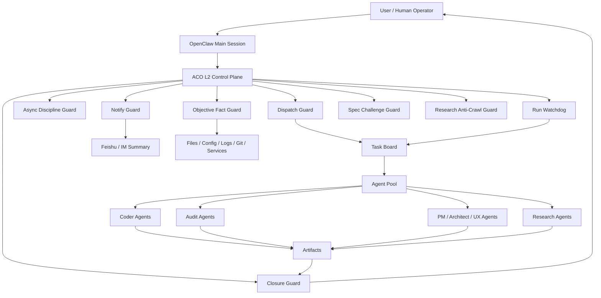

# ACO — Agent Coordination & Orchestration

**The runtime governance engine for AI Agent teams.**

ACO and SEVO together build an open-source, programmable, self-evolving governance kernel for AI Agent teams. The thesis is simple: an Agent system you can trust with production work treats governance as a first-class capability — equal in weight to construction, and designed as one integrated piece with it, not bolted on afterward.

CrewAI, AutoGen, LangGraph, and MetaGPT solve **"let agents start working."** ACO solves **"keep agents from losing control, drifting off-spec, or stalling out across long-horizon operation — and force every run to converge to a real, delivered result."**

**13 L2 plugins. 70+ deterministic rules. 16-way concurrent dispatch. Automatic dead-task cleanup.**

ACO turns multi-agent work from "agents can run" into "agents run under deterministic control." Orchestration, L2 guardrails, audit trails, failure recovery, and self-evolving operating discipline ship as one OpenClaw extension suite — at the runtime control plane, where rules cannot be diluted by long context or skipped by tired models.

---

## Why ACO exists

LLMs are powerful executors. They are weak governors.

A multi-agent system fails in boring, expensive, repeatable ways:

- The wrong agent takes the job.
- A coding agent reviews its own code.
- A long task blocks the main session, and user messages disappear.
- A spawned task stalls for 40 minutes with no useful output.
- A model says “done” after producing no file, no evidence, and no result.
- A research task hits anti-bot protection and quietly skips the source.
- A user asks “who changed this?” and the agent answers from memory instead of checking logs.
- A kill command wipes a useful partial result because nobody scanned the impact first.
- A completion event fires, but the human never gets a clean IM summary.

Prompt rules are not enough. Long contexts dilute them. Tired models skip them. Different agents interpret them differently.

ACO moves the critical rules down into the runtime control plane: deterministic checks, plugin-level interception, auditable decisions, and automatic recovery.

---

## What ACO controls

ACO is the control layer for OpenClaw-based agent teams.

It governs the full lifecycle:

1. **Intent intake** — understand task type, risk, role, and expected output.
2. **Dispatch** — select the right agent, timeout, label, and concurrency lane.
3. **Execution** — protect main session responsiveness and detect blocking behavior.
4. **Monitoring** — watch running tasks, stale tasks, dead tasks, and hollow completions.
5. **Recovery** — re-dispatch, escalate, split, or block unsafe continuation.
6. **Closure** — enforce audit, notification, evidence, and human-readable summary.
7. **Evolution** — turn repeated failures into stronger rules.

The result is simple: agents keep their creative power, and the system gains operational discipline.

---

## Core capabilities

### 1. Dispatch Guard / 派发守卫

Validates every dispatch before an agent starts work.

- Checks whether the target agent exists in the live OpenClaw configuration.
- Blocks same-agent concurrent execution.
- Enforces role-to-task matching.
- Verifies explicit `agentId` choices still match the task type, so a forced assignment cannot bypass role discipline.
- Strips invalid runtime overrides.
- Injects README quality rules when documentation tasks are detected.
- Blocks SEVO pipeline bypass when the pipeline owns the task.
- Enforces “no development without spec alignment” for coding work.
- Pre-checks task impact scope before spawn and requires the prompt to declare the intended file or artifact domain.

This is the front door of the system.

### 2. Run Watchdog / 运行看门狗

Keeps running tasks from turning into silent failures.

- Detects stale tasks.
- Cleans zombie sessions.
- Tracks timeout discipline.
- Marks orphaned running board entries as failed after a kill, so capacity and task state stay consistent.
- Prevents “it is still running” from becoming an excuse for no result.

Dead tasks get cleaned. Stuck work gets surfaced. Capacity returns to the pool.

### 3. Async Discipline Guard / 主会话异步纪律守卫

Protects the main conversation from blocking work.

- Blocks long polling in the main session.
- Blocks wait loops that should be push-based.
- Pushes long work into subagents or ACP agents.
- Keeps the human-facing channel responsive.

The main session stays free to receive the next user message.

### 4. Notify Guard / 完成通知守卫

Makes completion visible to the human.

- Requires a clean IM summary after completion events.
- Injects an audit reminder after development completion, so SEVO handoff to independent review is not skipped.
- Blocks closure when the user-facing notification is missing.
- Supports delivery discipline for Feishu/Lark-style workflows.

A task is not closed until the user actually receives the result.

### 5. Objective Fact Guard / 客观事实守卫

Stops agents from answering operational questions from memory.

- Forces live checks for task state, files, config, service status, resources, and Git state.
- Prefers current evidence over compressed session memory.
- Reduces false claims caused by stale context.

Facts come from files, configs, logs, commands, and current state.

### 6. Doctor Guard / Doctor 安全守卫

Protects the host from unsafe auto-fix behavior.

- Blocks `openclaw doctor --fix` and equivalent dangerous forms.
- Enforces read-only diagnosis first.
- Requires manual repair and a clean doctor result before restart discussion.

Health checks stay observable and reversible.

### 7. Closure Guard / 闭环守卫

Prevents vague endings.

- Requires clear done / not done / blocked status.
- Pushes evidence into the final report.
- Catches incomplete task closure.

No “looks good” endings. The system needs a real conclusion.

### 8. Output Humanizer Guard / 输出人话守卫

Keeps user-facing output direct and readable.

- Blocks mechanical AI phrasing.
- Encourages short, human summaries.
- Reduces technical leakage in final reports.

The user gets conclusions, not internal machinery.

### 9. Research Anti-Crawl Guard / 调研反爬守卫

Makes research tasks resilient instead of fragile.

- Requires fallback paths when a source blocks scraping.
- Prefers public APIs first.
- Supports third-party data services as a second path.
- Uses real-browser capture as the final fallback.

“Blocked by anti-bot” is a routing condition, not a valid stopping point.

### 10. Browser Session Lease / 浏览器会话租约

Controls scarce browser resources.

- Coordinates persistent browser usage.
- Prevents unsafe session collisions.
- Keeps browser automation predictable under parallel work.

Browser state becomes a managed resource.

### 11. Session Context Recovery / 会话上下文恢复

Reduces damage from compressed or lost context.

- Helps recover task-critical context.
- Keeps agents aligned after session truncation.
- Supports stronger continuity across long-running work.

The system assumes memory can fail and designs around it.

### 12. Spec Challenge Guard / Spec 挑战守卫

Raises the quality bar before implementation.

- Forces first-principles challenge on specs and architecture.
- Catches unverified assumptions.
- Pushes ambiguous requirements back into clarification or spec updates.

It protects the product from plausible but weak requirements.

### 13. Concurrency Efficiency Guard / 并发效率守卫

Keeps agent capacity active.

- Detects idle capacity while work remains.
- Encourages batch dispatch when multiple agents are available.
- Supports up to 16 concurrent execution lanes under configured limits.

Expensive agent capacity should not sit idle while queued work exists.

---

## Deterministic rule system

ACO ships with 70+ deterministic interception and guidance rules across dispatch, execution, notification, research, evidence checks, doctor safety, closure, and context recovery.

Examples:

- Block same-agent concurrent work.
- Block invalid agent IDs.
- Block main-session long builds and installs.
- Block dangerous doctor auto-fix commands.
- Require live task-board reads before reporting task state.
- Require independent audit after development.
- Require research reports to be written to files.
- Require anti-crawl fallback paths.
- Require Feishu/Lark summary delivery after completion.
- Require spec challenge before implementation.
- Require kill-impact scanning before destructive intervention.

These are runtime rules. They do not rely on model goodwill.

---

## How ACO differs from other agent frameworks

### CrewAI

CrewAI is strong at role-based collaboration and task flow definition. ACO focuses on runtime control: blocking unsafe dispatch, enforcing audit separation, cleaning dead tasks, and proving closure.

Use CrewAI when you need a clean agent-team abstraction. Use ACO when you need the team to stay operational under failure.

### AutoGen

AutoGen is strong at agent conversations and flexible interaction patterns. ACO focuses on operational discipline: main-session protection, deterministic routing, timeout enforcement, evidence gates, and notification gates.

Use AutoGen when you want agents to talk. Use ACO when you need agents to finish safely and visibly.

### LangGraph

LangGraph is strong at graph-based workflows and state transitions. ACO focuses on the control plane around real agent operations: who can run, how many can run, when to stop, when to escalate, and when to block.

Use LangGraph when the workflow graph is the product. Use ACO when live agent governance is the product.

### MetaGPT

MetaGPT is strong at software-team simulation. ACO focuses on deterministic guardrails for real multi-agent execution: dispatch rules, watchdogs, closure checks, anti-crawl discipline, and self-evolving operational rules.

Use MetaGPT when you want a structured AI company metaphor. Use ACO when you want production-grade agent governance.

---

## Architecture



The model proposes actions. ACO decides whether the runtime should allow them.

---

## Quick start

ACO is designed for OpenClaw extension deployment.

### 1. Install the package

```bash
npm install -g @self-evolving-harness/aco
```

### 2. Copy ACO extensions into OpenClaw

```bash
mkdir -p /root/.openclaw/extensions
cp -R ./extensions/aco-* /root/.openclaw/extensions/
```

If you installed from npm and want the packaged extension assets, locate the package first:

```bash
npm root -g
```

Then copy the extension directories from the package location into:

```bash
/root/.openclaw/extensions/
```

### 3. Initialize config

```bash
aco init
```

This creates or updates ACO configuration files and discovers the local OpenClaw agent pool.

### 4. Run a read-only health check

```bash
openclaw doctor
aco doctor
```

ACO intentionally avoids unsafe automatic repair. Diagnose first, fix manually, verify again.

### 5. Restart Gateway only after checks are clean

Use the normal OpenClaw gateway command after configuration is valid:

```bash
openclaw gateway restart
```

---

## Configuration example

```json
{
  "level": 2,
  "agents": [
    {
      "id": "cc",
      "role": "coder",
      "tier": "T1",
      "runtimeType": "acp"
    },
    {
      "id": "audit-01",
      "role": "auditor",
      "tier": "T2",
      "runtimeType": "subagent"
    },
    {
      "id": "pm-01",
      "role": "pm",
      "tier": "T3",
      "runtimeType": "subagent"
    }
  ],
  "concurrency": {
    "globalMax": 16,
    "perType": {
      "acp": 6,
      "subagent": 10
    }
  },
  "tiers": {
    "defaultTier": "T2",
    "autoEscalate": true,
    "maxEscalations": 3
  },
  "substantiveFailure": {
    "minOutputTokens": 3000,
    "requireFileOutput": true
  },
  "chains": [
    {
      "id": "dev-audit-chain",
      "trigger": "code:*",
      "steps": [
        {
          "action": "audit",
          "agentRole": "auditor",
          "timeoutSeconds": 600
        }
      ]
    }
  ]
}
```

Minimal config also works. ACO can start from detected OpenClaw state and unlock stricter controls as the agent pool grows.

---

## CLI surface

```bash
aco init          # Detect OpenClaw environment and create config
aco dispatch      # Dispatch a task through the rule system
aco task          # List, cancel, retry, and inspect tasks
aco board         # View the live task board
aco pool          # Inspect and sync the agent pool
aco rule          # List and manage dispatch rules
aco chain         # Manage workflow chains
aco stats         # Inspect capacity and throughput
aco audit         # Query decisions and guard events
aco config        # Inspect and validate config
aco notify        # Check notification routes
aco health        # Health check
aco doctor        # Health check alias
```

---

## Operational model

ACO uses layered control.

- **L0 — Host layer**: systemd, cron, process cleanup, service recovery.
- **L1 — OpenClaw Gateway**: routing, authentication, event dispatch.
- **L2 — ACO plugins**: deterministic interception, blocking, warning, rewriting, and evidence enforcement.
- **L3 — Hooks and chains**: completion-triggered audit, continuation, notification, and recovery.
- **L4 — Agent harness**: role-specific runtime configuration.
- **L5 — Config**: agent pool, tiers, concurrency, chains, and rule thresholds.
- **L6 — Prompt discipline**: human-readable operating rules for models.

ACO puts critical controls at L2 and L3 because those layers are harder for a model to forget.

Legacy task-board enqueue compatibility goes through `scripts/local-subagent-board.js`; the board bridge is not located at the workspace root.

---

## Designed for real failure

ACO assumes the following are normal:

- Agents will forget instructions.
- Long-running tasks will stall.
- Model output will sometimes be polite and empty.
- Memory will be compressed and lose details.
- Browser sessions will collide.
- Research targets will block automation.
- Users will care about the result, not the internal task label.

The system is built around those assumptions.

---

## Roadmap

### V2 deterministic blocking

- Expand rule coverage across tool calls, file writes, browser operations, and gateway lifecycle actions.
- Add stronger typed rule packs for coding, research, documentation, release, and incident response.
- Improve explainability for every block decision.

### Automatic dispatch

- Turn task-board backlog and idle-agent capacity into automatic dispatch plans.
- Add safer queue shaping for 16-way concurrent execution.
- Improve split-and-escalate logic for large documents, audits, and research tasks.

### Open-source generalization

- Remove host-specific assumptions from extension packaging.
- Provide clean install profiles for small teams, solo builders, and production OpenClaw deployments.
- Ship portable examples that work outside the original development workspace.

### Self-evolution

- Convert repeated bad cases into new deterministic rules.
- Promote proven local rules into reusable rule packs.
- Keep the control plane improving as agents and workflows evolve.

---

## License

MIT
