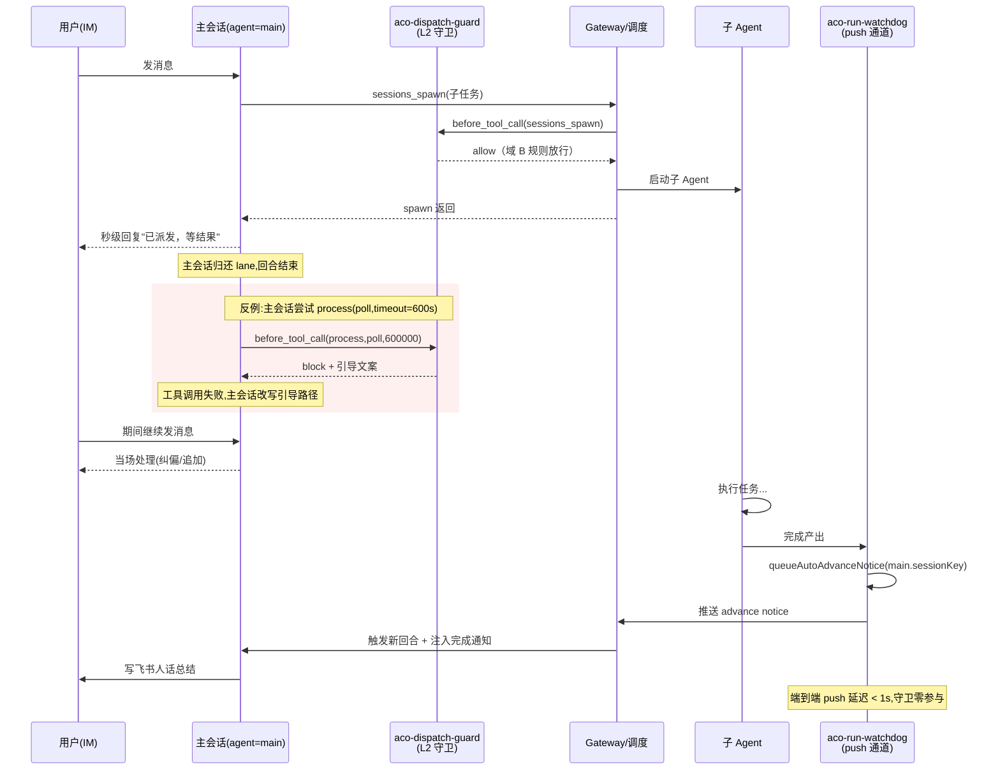

# FR-K01 主会话异步纪律守卫 · 架构设计

OpenClaw（sa-02 子Agent） · 2026-05-25

---

## 1. 架构师视角

### 1.1 设计目标

主会话（agent=main）在派出子 Agent 后必须秒级归还 IM 输入通道。L2 插件层强制约束「等结果」这件事改由 push-based completion event 触发新回合，而以同步阻塞原语（`process(action=poll, timeout>=5s)` 等）锁住 lane 的写法在工具调用入口被直接拒绝。

### 1.2 设计原则

1. **下沉到 L2 插件层**：与现有耗时命令守卫（L1290-L1320）、edit/write 守卫（L1322-L1334）共用 `before_tool_call` 钩点和 `appendAuditEvent` 审计通道，新规则按同样模式实现，零新增基础设施。
2. **只拦主会话**：`sessionKey.includes(':main:')` 判定，子 Agent 内部的 process 调用完全不动。
3. **与 push 通道物理解耦**：守卫只读 `event.params` 做拦截判定，不触碰 aco-run-watchdog 的 board/notice/completion 链路；两条通道在代码、状态、文件层面零交叉。
4. **豁免单次有效**：每次工具调用独立判定豁免，最近一条用户消息的关键词命中只放行当前调用，下一次调用重新走完整守卫。
5. **失败开放**：守卫自身异常走 graceful degradation，写 `bypass_degraded` 审计后 allow，避免插件 bug 把主会话锁死。

### 1.3 与现有架构的关系

| 维度 | 域 B（派发治理） | 域 K（异步纪律） |
|------|-----------------|------------------|
| 拦截目标 | sessions_spawn 派发参数合规性 | process 阻塞等待原语 |
| 触发主体 | 任意 agent 派发子任务 | 仅 agent=main |
| 审计文件 | aco-dispatch-guard-events.jsonl | 同上（共用 stream，rule 字段区分） |
| 加载机制 | aco-dispatch-guard 插件 | 同插件，新增规则块 |

---

## 2. 运行视角

### 2.1 挂载点

复用 `aco-dispatch-guard` 的 `before_tool_call` 注册（index.js L956-L958）。在已有的 `sessions_spawn` 校验、exec 耗时命令守卫、edit/write 代码文件守卫之后，追加 `process` 工具守卫块。

```
api.on('before_tool_call', async (event, hookCtx) => {
  const toolName = String(event?.toolName || hookCtx?.toolName || '');
  // ... 现有规则 ...
  // ── L2: 主会话异步纪律守卫（新增） ──
  if (toolName === 'process') {
    const decision = evaluateAsyncDiscipline({ event, hookCtx });
    if (decision.block) return { block: true, blockReason: decision.reason };
  }
  // ... 后续规则 ...
});
```

钩点选择 `before_tool_call` 而非 `tool_call:before` 是因为现有插件统一注册的是前者，hookCtx 提供 `sessionKey`、`agentId`、`toolName`，event.params 透出工具调用参数，与 spec AC1 描述的 `tool_call:before` 语义对齐（spec 用了通用术语，实现落到 Gateway 实际暴露的事件名）。

### 2.2 拦截规则

```
INPUT:
  toolName        = 'process'
  args.action     ∈ {'poll', 'wait', 'log', 'list', ...}
  args.timeout    = number | undefined
  hookCtx.sessionKey
  config          = openclaw.json -> aco-dispatch-guard.asyncDisciplineGuard

PRECONDITIONS:
  1. config.enabled === true                 否则 → bypass_disabled
  2. guard 状态非 degraded                    否则 → bypass_degraded
  3. sessionKey 包含 ':main:'                 否则 → allow（子 agent 不拦）
  4. action ∈ BLOCKING_ACTIONS                否则 → allow
     BLOCKING_ACTIONS = ['poll', 'wait', 'log', 'list']
  5. timeout >= config.maxBlockingTimeoutMs   否则 → allow（默认 5000ms）

EXEMPTION CHECK:
  recentUserMessage = readRecentUserMessage(hookCtx.sessionKey)
  for keyword in config.userExemptKeywords:
    if recentUserMessage.toLowerCase().includes(keyword.toLowerCase()):
      decision = exempt
      exemptKeyword = keyword
      → 写审计 → return allow（仅本次）

DEFAULT:
  decision = block
  → 写审计 → return { block: true, blockReason: 引导文案 }
```

`sessionKey` 起点 agent 判定与 aco-run-watchdog 一致（`aco-run-watchdog/index.js:613` 的 `String(rec?.sessionKey || '').startsWith('agent:main:')`），守卫这里用 `includes(':main:')` 兼容历史 sessionKey 格式，与现有 exec 守卫的 `isMain` 判定（L1293）保持完全一致。

### 2.3 豁免逻辑

豁免依赖「读取最近一条用户消息」。Gateway 当前 `before_tool_call` 钩点不直接传 messages，需要在插件内维护一个轻量缓存：

```
缓存结构: Map<sessionKey, { text: string, ts: number }>
写入时机: api.on('before_prompt_build', ({ session, messages }) => {
            if (session?.agentId !== 'main') return;
            const lastUser = [...messages].reverse().find(m => m.role === 'user');
            if (lastUser) cache.set(session.sessionKey, { text: lastUser.text, ts: Date.now() });
          })
读取时机: 守卫内 readRecentUserMessage(sessionKey)
TTL:     无 TTL，下一次 before_prompt_build 自然覆盖；进程重启清空（首次调用退化为无豁免）
```

**关键约束**：
- 豁免「仅当前任务有效」 = 每次工具调用独立判定 = 不引入任何「已豁免」状态位 = 缓存只读，不修改。
- 用户没再说豁免关键词 → 下一次 process 调用读到的还是最后那条不含关键词的消息 → 自动重新拦截。spec 完成判定第二条"再下一次调用恢复被拦截"由「无副作用判定」天然满足，不需要额外 reset 逻辑。
- 关键词匹配：子串包含、大小写不敏感、`String.prototype.toLowerCase().includes()`。
- 默认关键词列表（落到 openclaw.json 默认值）：`["豁免", "亲自做", "我授权", "用 poll", "主会话直接干", "我盯着", "不要派"]`。

### 2.4 审计日志 schema

写入 `/root/.openclaw/workspace/logs/aco-dispatch-guard-events.jsonl`，沿用现有 `appendAuditEvent` 函数（L762），新增字段：

```json
{
  "ts": "2026-05-25T01:51:00.123Z",
  "rule": "async-discipline",
  "ruleId": "dispatch.process.async_discipline_blocked",
  "decision": "block",
  "toolName": "process",
  "sessionKey": "agent:main:feishu:direct:ou_xxx",
  "agentId": "main",
  "toolArgs": {
    "action": "poll",
    "timeout": 600000,
    "sessionId": "<truncated 60>"
  },
  "timeoutMs": 600000,
  "exemptKeyword": null,
  "triggerKeyword": null,
  "recentUserMessageHash": "a1b2c3d4e5f60718",
  "reason": "主会话禁止 process 阻塞等待 timeout>=5000ms..."
}
```

**字段语义**：

| 字段 | 取值范围 | 说明 |
|------|---------|------|
| `rule` | `async-discipline` | 域级标签，用于 `aco audit async-discipline` 过滤 |
| `ruleId` | `dispatch.process.async_discipline_*` | 细分规则 id（blocked / exempted / bypass_disabled / bypass_degraded） |
| `decision` | `block` / `allow` / `exempt` / `bypass_disabled` / `bypass_degraded` | 与 spec AC5 对齐 |
| `toolArgs` | `{action, timeout, ...}` | 参数摘要，敏感字段（如 sessionId）截断到 60 字符 |
| `timeoutMs` | number | 透出 timeout 数值，便于按阈值聚合统计 |
| `exemptKeyword` | string \| null | decision=exempt 时填命中关键词；其他场景为 null |
| `triggerKeyword` | string \| null | 同 exemptKeyword 的别名（spec 输入字段名），保留兼容；实现内部统一用 exemptKeyword |
| `recentUserMessageHash` | string \| null | SHA-256 截断 16 位，仅用于审计追溯，不泄露用户消息内容 |

`triggerKeyword` 与 `exemptKeyword` 在落盘时同时写两份指向同一值，避免下游消费方两个名字都猜。

### 2.5 双通道协同

守卫拦的是「主会话主动调 process 阻塞」这条入口；子 Agent 完成后通过 aco-run-watchdog 的 `queueAutoAdvanceNotice → consumeAutoAdvanceNotice` 链路推送到 main session 的 `before_prompt_build`，触发新回合。两条通道在以下层面物理隔离：

- **代码模块**：守卫在 `aco-dispatch-guard/index.js`；推送在 `aco-run-watchdog/index.js`。互相不 import。
- **事件钩点**：守卫挂 `before_tool_call`；推送链路用 sessions_send / 内部 advance notice 队列 + `before_prompt_build` 注入。
- **状态文件**：守卫只读 `openclaw.json` 配置 + 写 `aco-dispatch-guard-events.jsonl`；aco-run-watchdog 维护 `aco-run-watchdog-state.json` / `aco-run-watchdog-events.jsonl` / `subagent-task-board.json`。
- **触发条件**：守卫由 main 调 process 触发；推送由子 Agent 完成触发。两者不存在事件依赖。

#### 2.5.1 spawn → completion event 路径无损（Mermaid sequenceDiagram）



灰底框是守卫拦截的反例分支，与正常 push 通道是两条互不干扰的执行流。spec 完成判定第三条「异步及时性零退化」由此结构保证：守卫只挂 main 的 `before_tool_call`，物理上不会延迟 RW 推到 main 的任何事件。

### 2.6 拦截响应文案

被 block 时返回给主会话的 `blockReason`（也是 spec AC2 要求的「结构化错误响应」内容）：

```
[ACO 异步纪律守卫] 主会话被禁止调用 process(action=<X>, timeout=<Y>ms) 同步等待。
原因: 此调用会锁住主会话 lane，期间用户 IM 消息会被静默排队，体感等同失联。

合规路径(任选其一):
  1. 信任 push-based completion event。spawn 后直接结束当前回合,
     子 Agent 完成时 aco-run-watchdog 会自动触发新回合,无需主动 poll。
  2. 确实需要观察某个进程状态,改派一个短任务子 Agent 异步执行 poll,
     完成后通过 completion event 回报结果。

豁免方式: 用户在最近一条 IM 消息中显式包含以下任一关键词:
  豁免 / 亲自做 / 我授权 / 用 poll / 主会话直接干 / 我盯着 / 不要派
豁免仅本次有效,下次调用重新走完整守卫。

命中规则: dispatch.process.async_discipline_blocked
```

文案目标：让 LLM 看一眼就知道走 push 通道或派子 Agent 两条路；豁免成本写明确，避免模型在没有用户授权的情况下自己编关键词绕过。

---

## 3. 约束

### 3.1 边界

1. **agent=main 才生效**：`sessionKey` 不含 `:main:` → 守卫直接 allow。子 Agent 内部 process(poll) 不被拦截，子 Agent 可以等自己的孙子任务。
2. **timeout < maxBlockingTimeoutMs（默认 5s）允许**：spawn 后立即查看板（`process(action=log, timeout=2000)` 之类的秒级查询）必须放行，否则正常的「派发后看一眼板」工作流会被打死。spec AC7 明确阈值可配。
3. **action 不在 BLOCKING_ACTIONS 列表内允许**：例如 `action=kill`、`action=write`、`action=submit` 这些不属于阻塞等待语义，不拦。
4. **test mode 豁免**：`process.env.NODE_ENV === 'test'` 或 `process.env.ACO_DISPATCH_GUARD_TEST_MODE === '1'` 时全量跳过守卫并写 `bypass_disabled` 审计，便于 CI 跑端到端测试。
5. **配置非法时 fail-safe**：`maxBlockingTimeoutMs <= 0` 拒绝加载，回退到默认值 5000，写 warn 日志（spec AC7 要求）。
6. **守卫异常 graceful degradation**：try/catch 包裹整个 evaluate 函数，异常时 mark `dispatchGuardGlobal.asyncDisciplineDegraded = true`，后续调用走 `bypass_degraded` 路径直接 allow（spec AC8）。

### 3.2 配置 schema（openclaw.json 片段）

```json
{
  "extensions": {
    "entries": {
      "aco-dispatch-guard": {
        "config": {
          "asyncDisciplineGuard": {
            "enabled": true,
            "maxBlockingTimeoutMs": 5000,
            "blockingActions": ["poll", "wait", "log", "list"],
            "userExemptKeywords": [
              "豁免", "亲自做", "我授权", "用 poll",
              "主会话直接干", "我盯着", "不要派"
            ]
          }
        }
      }
    }
  }
}
```

`aco init` 生成的默认配置写入这一段（spec AC11）。

### 3.3 实现复用

| 现有能力 | 复用方式 |
|---------|---------|
| `before_tool_call` 注册（L956） | 在同 handler 内追加 process 分支，不新增 api.on |
| `appendAuditEvent`（L762） | 直接调用，rule 字段填 `async-discipline` |
| `isMain` 判定模式（L1293） | 同款 `sessionKey.includes(':main:')` |
| `dispatchGuardGlobal` 状态对象（L22） | 新增 `asyncDisciplineDegraded`、`recentUserMessageCache` 两个字段 |
| `before_prompt_build` 注册（L941） | 同时注册一个 priority 较低的 handler 写 recent message cache |
| `aco-dispatch-guard-events.jsonl` | 写入新 ruleId，无 schema breaking change |

---

## 4. 风险与缓解

### 4.1 误拦风险

**风险**：主会话本来就有少数合法的 process 阻塞场景（例如 main 自己起一个秒级 sqlite 查询子进程，调 `process(action=poll, timeout=3000)` 等结果）。

**缓解**：默认阈值 5000ms 把秒级查询整体放行；超过 5s 的场景按 spec 设计就是要拦。如果真有合法长查询，用豁免关键词或者拆成派子 Agent。

### 4.2 用户消息缓存丢失

**风险**：插件首次加载或 Gateway 重启后，`recentUserMessageCache` 为空，第一次 process 调用读不到最近用户消息，即使用户刚说过「豁免」也会被拦。

**缓解**：缓存丢失场景守卫倾向「拦截」（保守路径），用户感知到拦截后再发一条豁免消息即可解锁。这比反过来「丢缓存默认放行」要安全得多——后者会导致重启后第一发 poll 直接锁死 lane。审计日志里 `recentUserMessageHash` 写入特殊值 `cache_miss` 便于排查。

### 4.3 关键词被滥用

**风险**：模型自己在 prompt 里编造「我已豁免」之类的内容来绕过守卫。

**缓解**：豁免关键词只从「最近一条 role=user 的真实消息」里读，不读 system / assistant / tool 消息。`before_prompt_build` 的 messages 是 Gateway 提供的真实历史，模型无法自己塞 role=user 进去。

### 4.4 push 通道异常导致 main 真的需要 poll

**风险**：aco-run-watchdog 异常、completion event 没推到，子 Agent 实际完成但 main 不知道，主会话被守卫拦着也没法 poll 看状态。

**缓解**：
1. 守卫错误文案明确给出「派短任务子 Agent 异步 poll」这条合规路径，main 可以 spawn 一个 30 秒超时的检查 Agent，自己继续不阻塞。
2. spec 域 B / 域 H 已有 stale completion 检测和 watchdog 自恢复机制（aco-run-watchdog 的 `staleCompletions` 与 `recovery_started` 事件，L1258、L117），独立兜底，不依赖 main 来 poll。
3. 用户层兜底：豁免关键词「我盯着」让用户在 push 真挂的紧急情况下手动解锁守卫。

### 4.5 与现有 exec 守卫的规则冲突

**风险**：现有 exec 耗时命令守卫（L1290）拦的是「主会话执行 npm run build」这类 shell 命令；新规则拦的是「主会话 process 工具阻塞调用」。两者目标不同但都挂在 main session，需要确认审计 ruleId 不冲突。

**缓解**：新 ruleId 命名空间 `dispatch.process.async_discipline_*` 与现有 `dispatch.exec.main_session_blocked`、`dispatch.edit_write.main_session_code_blocked` 平行，审计字段 `rule` 用域级标签 `async-discipline` 区分，下游消费侧零歧义。

### 4.6 配置热更新

**风险**：用户改了 `maxBlockingTimeoutMs` 后是否需要重启 Gateway？

**缓解**：现有插件已有 `startConfigWatcher()`（L928 附近）做配置变更监听，新规则的配置读取在每次 `evaluateAsyncDiscipline` 调用时从最新配置快照取值，热更新生效。配置非法时回退默认值，不阻塞。

---

## 5. 关键架构决策点

1. **不新增钩点，不新增插件**：完全复用 aco-dispatch-guard 的 `before_tool_call` 入口和 `appendAuditEvent` 出口，新规则就是一个分支。维护成本最低、与现有审计流统一。
2. **豁免无状态**：每次工具调用独立判定，不存「已豁免」标志位。spec AC4「豁免不传染下一次」由「无副作用」天然实现，不需要额外 reset 逻辑或定时器。
3. **用户消息缓存放在 before_prompt_build**：Gateway 在每次主会话开新回合时必走 `before_prompt_build`，messages 包含最新用户消息。守卫只在 `before_tool_call` 读缓存，不主动查 Gateway 历史，性能和耦合都最优。
4. **失败开放原则**：守卫异常 → 主会话工具调用照走（写 bypass_degraded 审计）。守卫存在的目的是辅助纪律，不应该因为自己的 bug 把主会话物理锁死，与 push 通道独立性同源。
5. **审计字段双名兼容**：`exemptKeyword` 和 `triggerKeyword` 同时写入，spec 用了后者命名，实现内部统一前者，避免下游消费方两个名字猜不出哪个有值。
6. **timeout < 5s 放行**：spawn 后秒级查看板的工作流是合规节奏，必须不能误伤。阈值参数可配，产品方可按风险偏好下调。
